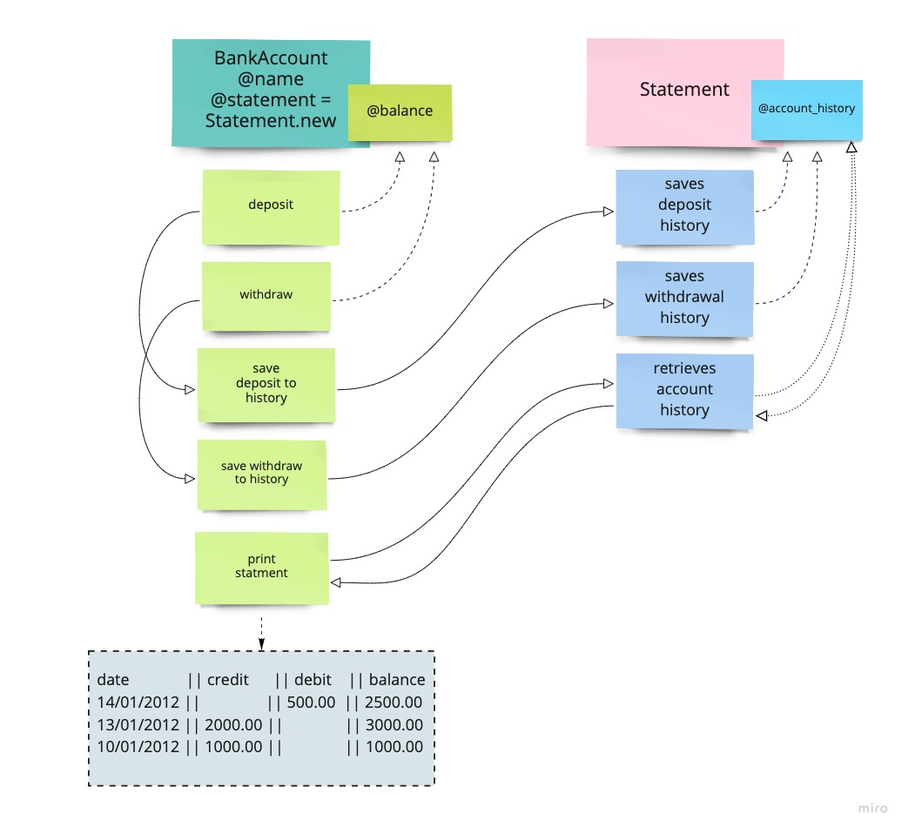

BANK TECH TEST
==============


````
### Requirements
#### technical:
- Code is written in Ruby  
- Code is interactive with a REPL, in this case IRB
- Code is uses the linter, Rubocop

#### program features:
- Deposits/withdrawal  
- Account statement (date, amount, balance) printing  
- Data can be kept in memory (not stored in a database)  
````
````
### Acceptance Criteria

Given a client makes a deposit of 1000 on 10-01-2012  
And a deposit of 2000 on 13-01-2012  
And a withdrawal of 500 on 14-01-2012  
When they print their bank statement  
Then they would see  

date || credit || debit || balance
14/01/2012 || || 500.00 || 2500.00
13/01/2012 || 2000.00 || || 3000.00
10/01/2012 || 1000.00 || || 1000.00
````
-----

### Modelling

| class        |  instances                   |  methods                             |
|--------------|------------------------------|--------------------------------------|
| BankAccount  |  @name                       |  deposit(amount, date)               |
|              |  @balance = 0                |  withdraw(amount, date)              |
|              |  @statement = Statement.new  |  save_deposit_to_statement(amount)   |
|              |                              |  save_withdraw_to_statement(amount)  |
|              |                              |  print_statement                     |
|--------------|------------------------------|--------------------------------------|
| Statement    |  @account_history = []       |  save_deposit_history(amount, date)  |
|              |                              |  save_withdraw_history(amount, date) |
|              |                              |  format_statement                    |
|              |                              |    -> write_statement_lines          |
|--------------|------------------------------|--------------------------------------|

  


Notes:
- Statement is dependant on BankAccount  
- name instance is added to BankAccount as a nice to have, so that new accounts can be created and separately identified

----

```
### to install and run tests
* clone code to local machine  
* run bundle install to install dependancies  
* run tests with the 'rspec' command  
* run linter with the 'rubocop' command  
```

### feature testing with irb
- require './lib/bank_account'   

- client1 = BankAccount.new("Client1")  

- client1  
=> #<BankAccount:0x00007fc5ec1e65b8 @name="Client1", @balance=0, @statement=#<Statement:0x00007fc5ec1e6568 @account_history=[]>>  

- client1.deposit(25)   
 => "Deposit amount saved to statement"   

- client1  
  => #<BankAccount:0x00007f90f5318570 @name="Client1", @balance=25, @statement=#<Statement:0x00007f90f5318520 @account_history=[{:Date=>"05-05-2021", :Deposit=>25, :Withdraw=>nil, :Balance=>25}]>>    

- client1.print_statement  
Date       || Deposit  || Withdraw || Balance
05-05-2021 || 25       ||          || 25      
 => "End of statement"

- client1.withdraw(10)   
 => "Withdrawal amount saved to statement"   

- client1.print_statement   
Date       || Deposit  || Withdraw || Balance
05-05-2021 ||          || 10       || 15      
05-05-2021 || 25       ||          || 25      
 => "End of statement"    

- client1.balance   
 => 15   

 - notes:   
 - print statement as a formatted table
